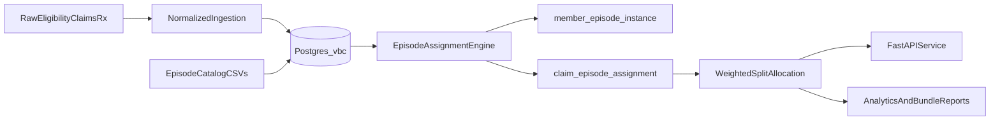

# Architecture

## Objectives

- Standardize **medical and pharmacy** claims into a consistent analytic model in PostgreSQL (`vbc` schema).
- Support **bundled / episodic** programs via a **catalog-driven** rule engine with **multi-episode assignment**, weighted split allocation, and explainable outputs.
- Support attribution, contracts, and legacy **PMPM / risk / shared savings** reporting alongside bundle rollups.
- Provide **orchestration-friendly** entrypoints, validation, and reconciliation suitable for a production data platform fork.

## Reference workflow

1. Land raw eligibility, provider, medical, and pharmacy extracts (CSV, SFTP, lake objects).
2. Load **normalized** tables in Postgres (`claim_*`, `rx_*`, `member`, etc.).
3. Load **episode catalog** (`episode_definition`, `episode_rule`, `code_set*`, `episode_rule_window`).
4. Run `assign-episodes` to create `member_episode_instance` and `claim_episode_assignment` with weighted split allocation fields.
5. Build derived tables (e.g. `member_month`) and run reporting: PMPM, risk, contracts, **bundle spend** (`report-bundles`).
6. Serve results via API (`vbc-claims-api`) for downstream applications and internal tooling.
7. In production: add orchestration (Airflow / Dagster / Prefect), data quality gates, and environment-specific secrets.

## Modules

| Module | Purpose |
|--------|---------|
| `vbc_claims.io` | SQLAlchemy engine and SQL file execution |
| `vbc_claims.etl` | Loaders, synthetic generator, validators, `run_full_pipeline` |
| `vbc_claims.episodes` | Deterministic INDEX / window / inclusion / exclusion assignment |
| `vbc_claims.transforms` | Derived tables (member months) |
| `vbc_claims.measures` | PMPM, bundle spend rollups |
| `vbc_claims.contracts` | Benchmarks and shared savings |
| `vbc_claims.analytics` | Composed reporting |
| `vbc_claims.quality` | Reconciliation and DQ hooks |
| `vbc_claims.api` | FastAPI endpoints for catalog, assignment, and reports |

## Deployment notes

This repository uses **Postgres 16** in Docker Compose for local development. Typical production patterns:

- **Lakehouse** or object store for immutable raw feeds
- **Warehouse** or Postgres for curated analytic schemas
- **Orchestration** with Airflow, Dagster, or Prefect (`scripts/pipeline_tasks.py` as stubs)
- **Observability**: reconciliation reports, row counts, cost drift vs benchmarks, episode instance volume alerts
- **Governance**: PHI segregation, RBAC, audit trails for catalog changes (not included here—add in your fork)

See [episodes.md](episodes.md) for episode semantics and [data_dictionary.md](data_dictionary.md) for table-level detail.
