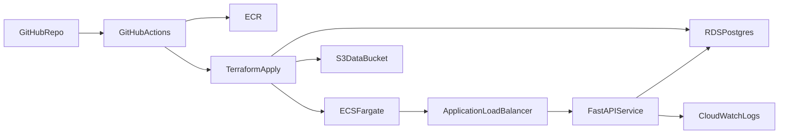

# Deploy on AWS (Production-Hardened Foundation)

This guide maps local workflows to AWS runtime for the bundled treatment engine.

## Architecture

## Prerequisites

- AWS account with OIDC role for GitHub Actions.
- Route53/ACM (if enabling TLS and custom domain).
- Terraform >= 1.6.
- ECR repository for app images.

## One-Time Bootstrap

1. Configure GitHub secrets:
   - `AWS_GITHUB_OIDC_ROLE_ARN`
   - `AWS_REGION`
   - `AWS_ECR_REPOSITORY`
   - `DB_PASSWORD`
2. Initialize Terraform:
   - `cd infra/aws/terraform`
   - `terraform init`
3. Plan/apply environment:
   - `terraform plan -var-file=env/dev.tfvars -var='db_password=...' -var='container_image=...'`
   - `terraform apply ...`

## Deploy/Update Flow

1. Build image and push to ECR.
2. Run Terraform apply with updated `container_image`.
3. ECS rolls out new task definition with circuit-breaker rollback.
4. Validate:
   - ALB target health
   - `/health` and `/ready`
   - reconciliation metrics

## Rollback Runbook

- Use previous image tag and re-apply Terraform.
- If schema/regression issues occur, redeploy prior task revision.
- For critical DB issues, restore latest RDS snapshot and cut over.

## Cost and Scaling Knobs

- ECS: `desired_count`, task `cpu/memory`
- RDS: `instance_class`, `allocated_storage`, backup retention
- Logs: retention window in CloudWatch log groups
- Network: NAT/public egress strategy based on compliance posture

